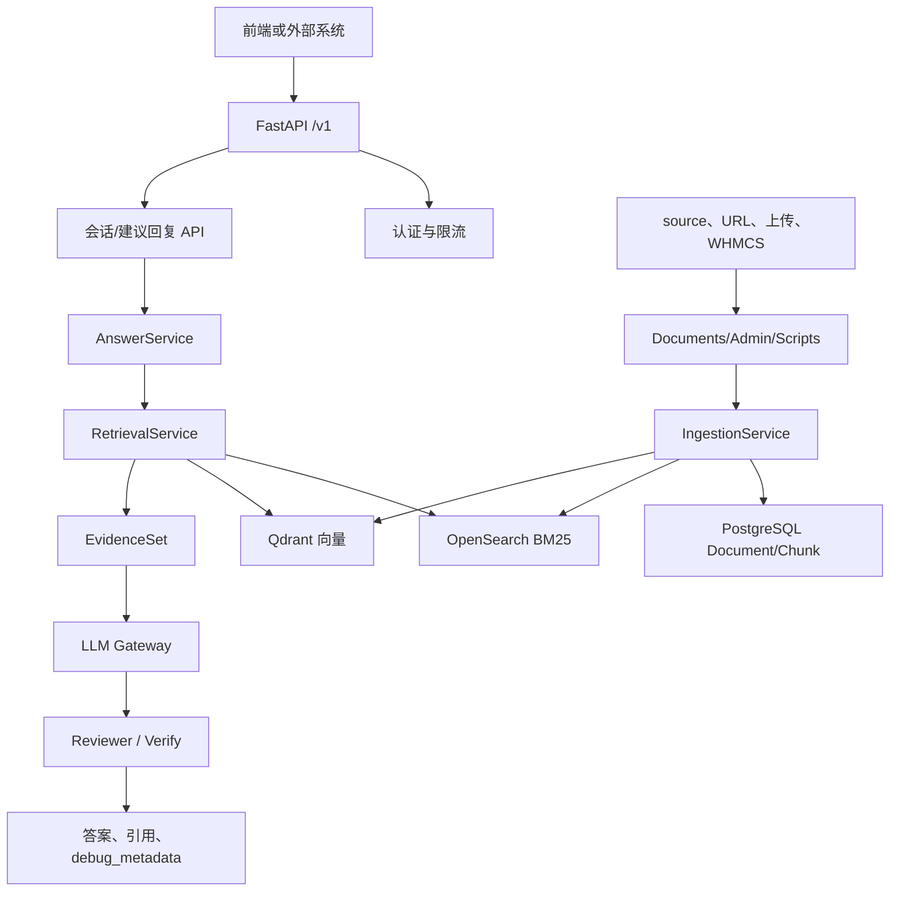

# 00_PROJECT_MAP.md

## 结论
本项目是面向企业客服场景的 RAG 支持助手：FastAPI 提供 API，React/Vite 提供管理和客服界面，PostgreSQL 保存业务数据，Redis/Celery 处理异步任务，OpenSearch 做 BM25，Qdrant 做向量检索，MinIO 做对象存储。

## 已读取证据
- `README.md`：未发现，待补充或确认是否由 `README_zh.md` 替代。
- `README_zh.md`：确认项目定位、技术栈、API、入库方式、前端页面和测试方式。
- `docker-compose.yml`：确认 frontend、api、worker、postgres、redis、opensearch、qdrant、minio 的运行关系。
- `.env.example`：确认 LLM、embedding、retrieval、WHMCS、MinIO、认证等配置入口。
- `app/main.py`：确认 FastAPI 路由注册和启动缓存加载。
- `git ls-files`：确认目录结构和关键文件。

## 项目地图

| 维度 | 结论 | 证据文件 |
|---|---|---|
| 后端入口 | `app.main:create_app()` 创建 FastAPI 应用，挂载 auth、dashboard、conversations、reply、documents、tickets、admin、health。 | `app/main.py` |
| 前端入口 | React + Vite，`App.tsx` 注册 Login、Conversations、Tickets、Documents、Crawler、Dashboard、Settings 等页面。 | `frontend/src/App.tsx` |
| API 客户端 | 前端通过 `frontend/src/api/client.ts` 封装 `/v1` API，请求头支持 API key、Admin API key、Bearer token。 | `frontend/src/api/client.ts` |
| 数据层 | SQLAlchemy 模型包含 Document、Chunk、Conversation、Message、Citation、Ticket、User、ApiToken、AppConfig、Intent、DocTypeModel 等。 | `app/db/models.py` |
| 异步任务 | Celery app 使用 Redis broker/backend，`worker.tasks.ingest_documents` 执行文档入库。 | `worker/celery_app.py`, `worker/tasks.py` |
| 检索层 | `RetrievalService` 组合 OpenSearch、Qdrant、embedding provider、reranker，并构建 EvidenceSet。 | `app/services/retrieval.py`, `app/search/` |
| 生成层 | `AnswerService` 编排 intent cache、语言识别、normalizer、orchestrator phases、LLM 和 reviewer。 | `app/services/answer_service.py`, `app/services/phases/` |
| 入库层 | `IngestionService` 负责清洗、分块、embedding、写入 DB/OpenSearch/Qdrant；具体函数细节待代码确认。 | `app/services/ingestion.py` |
| 部署 | Docker Compose 启动 frontend、api、worker、postgres、redis、opensearch、qdrant、minio。 | `docker-compose.yml` |

## 目录结构

```text
app/
  main.py                 FastAPI 应用入口
  api/routes/             auth、conversations、reply、documents、tickets、admin、dashboard、health
  services/               RAG 编排、入库、检索计划、LLM 网关、配置缓存、工单同步
  services/phases/        RAG 阶段：retrieve、assess、decide、generate、verify
  search/                 OpenSearch、Qdrant、embedding、reranker
  db/                     SQLAlchemy models 和 session
  crawlers/               WHMCS Playwright 爬虫
worker/                   Celery 应用和入库任务
frontend/                 React + Vite 前端
scripts/                  初始化、入库、WHMCS 导入、调试脚本
alembic/                  数据库迁移
nginx/                    full profile 下的 nginx 配置
source/                   运行时知识库源文件目录，可能未纳入 git
.agent-harness/           Codex 轻量 harness 文档
```

## 核心流程总览



## 低风险改动区域
- 文档：`AGENTS.md`、`.agent-harness/*.md`、README 类文档。
- 前端文案：单页文案或标签，但需避免无关格式化。
- 配置说明：`.env.example` 的注释可小步调整，但当前任务不修改。
- 测试：新增或调整与变更直接相关的 `tests/test_*.py`。

## 高风险区域
- Docker、Compose、Nginx、数据卷和服务端口：影响部署和本地环境。
- Alembic 迁移、认证、JWT、API token：影响数据和安全。
- RAG 编排、检索排序、EvidenceSet、Reviewer：影响回答质量，需要先画流程和跑窄测试。
- WHMCS 爬虫和工单导入：可能触发外部系统访问或数据写入。
- 删除类接口：`documents` 删除会尝试删除 OpenSearch/Qdrant chunk，并同步 source JSON。

## 待确认事项
- `README.md` 是否应新增或改名为 `README_zh.md` 的入口。
- `source/` 是否为运行时目录，当前 `git ls-files` 未列出具体源文件。
- `IngestionService.ingest_document` 内部写入 OpenSearch/Qdrant 的精确调用顺序待代码确认。
- 生产环境是否固定使用 Docker Compose，还是还有其他部署方式，待确认。
