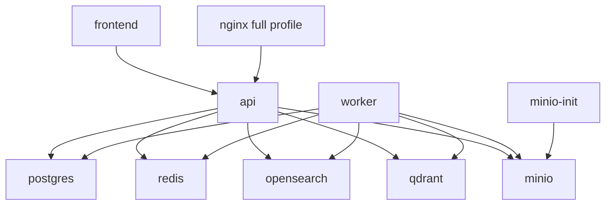

# 01_SERVICE_MAP.md

## 结论
本项目的运行时由 Docker Compose 串联：frontend 访问 api，api 与 worker 共享后端镜像和环境变量，PostgreSQL 存业务数据，Redis 同时承担缓存和 Celery broker/backend，OpenSearch/Qdrant 负责混合检索，MinIO 提供对象存储。

## 服务清单

| 服务 | 职责 | 端口 | 关键依赖 |
|---|---|---|---|
| `frontend` | React/Vite 构建后的静态前端，由容器内 nginx 提供页面。 | `5174:80` | `api` |
| `nginx` | full profile 下的网关，监听 80。 | `80:80` | `api` |
| `api` | FastAPI 服务，挂载 `/v1` API，负责认证、会话、RAG、文档、工单、后台配置。 | `8000:8000` | postgres、redis、opensearch、qdrant、minio |
| `worker` | Celery worker，处理异步入库任务。 | 无公开端口 | postgres、redis、opensearch、qdrant、minio |
| `postgres` | 主业务数据库。 | `127.0.0.1:5433 -> 5432` | volume `postgres_data` |
| `redis` | 缓存、队列 broker、Celery result backend。 | `127.0.0.1:6380 -> 6379` | volume `redis_data` |
| `opensearch` | BM25/关键词搜索索引。 | `127.0.0.1:19200 -> 9200`, `19600 -> 9600` | volume `opensearch_data` |
| `qdrant` | 向量检索集合。 | `127.0.0.1:6333 -> 6333` | volume `qdrant_data` |
| `minio` | S3 兼容对象存储。 | `127.0.0.1:9000`, `9001` | volume `minio_data` |
| `minio-init` | 创建 `support-ai-docs` bucket。 | 无 | minio |

## 依赖方向

## api 服务
- 启动命令：`uvicorn app.main:app --host 0.0.0.0 --port 8000`
- 代码入口：`app/main.py`
- 路由前缀：默认 `/v1`
- 启动时尝试刷新缓存：branding、doc type、LLM config、embedding config、archi config。
- 环境变量重点：
  - 数据库：`DATABASE_URL`, `DATABASE_URL_SYNC`
  - Redis：`REDIS_URL`, `CELERY_BROKER_URL`
  - 搜索：`OPENSEARCH_HOST`, `QDRANT_HOST`, `QDRANT_PORT`
  - 模型：`OPENAI_API_KEY`, `OPENAI_BASE_URL`, `LLM_MODEL`, `LLM_FALLBACK_MODEL`, `LLM_MODEL_ECONOMY`
  - 认证：`API_KEY`, `ADMIN_API_KEY`, `JWT_SECRET`
  - 对象存储：`OBJECT_STORAGE_URL`, `OBJECT_STORAGE_ACCESS_KEY`, `OBJECT_STORAGE_SECRET_KEY`, `OBJECT_STORAGE_BUCKET`

## worker 服务
- 启动命令：`celery -A worker.celery_app worker --loglevel=info`
- broker：`settings.celery_broker_url`，compose 中为 `redis://redis:6379/1`
- backend：`settings.redis_url`，compose 中为 `redis://redis:6379/0`
- 当前明确任务：`worker.tasks.ingest_documents`
- 业务边界：worker 处理入库，不应承载同步用户请求逻辑。

## PostgreSQL
- 存储 Document、Chunk、Conversation、Message、Citation、Ticket、User、ApiToken、AppConfig、Intent、DocTypeModel 等。
- 迁移目录：`alembic/versions/`
- 注意：迁移属于高风险区域，除非任务明确要求，不要修改。

## Redis
- 同时作为应用缓存和 Celery 基础设施。
- `REDIS_URL` 与 `CELERY_BROKER_URL` 使用不同 DB 编号。
- 排查 Celery 或缓存问题时，应先确认 Redis 服务状态，再看 worker 日志。

## OpenSearch
- 用于 BM25 和关键词检索。
- 默认 index：`support_docs`，来源于 `app/core/config.py`。
- 当前 compose 禁用 OpenSearch security plugin，适合本地开发，不代表生产安全配置。

## Qdrant
- 用于向量检索。
- 默认 collection：`support_chunks`，来源于 `app/core/config.py`。
- embedding 维度必须与 collection 向量维度一致；切换 embedding 模型时要谨慎。

## MinIO
- 默认 bucket：`support-ai-docs`
- 由 `minio-init` 容器创建 bucket。
- 文件上传路径和对象存储调用细节待代码确认。

## 前端
- Docker 端口：`5174`
- 本地开发端口：README_zh 中记录为 `5173`
- 构建命令：`cd frontend && npm run build`
- API base：由 `frontend/src/api/client.ts` 中的环境变量和默认值控制，具体默认值待代码确认。

## 不要轻易改动
- 服务端口、数据卷、healthcheck。
- `JWT_SECRET` 相关逻辑。
- `opensearch` 和 `qdrant` 的数据清理。
- `minio-init` bucket 名称。
- worker broker/backend 配置。
