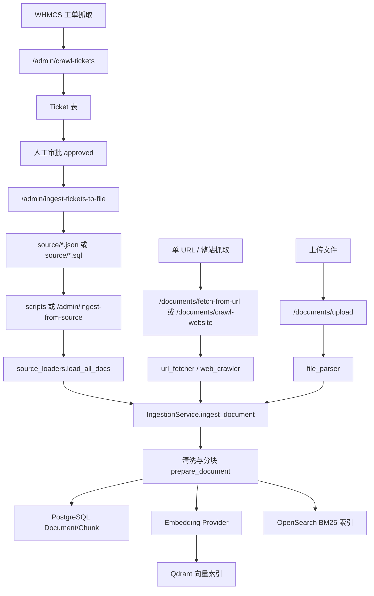
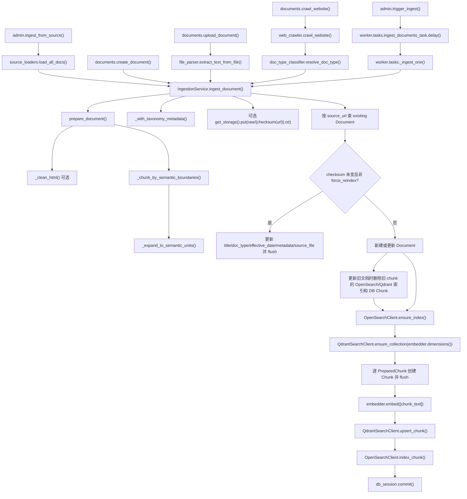
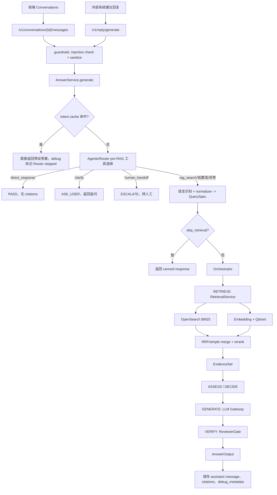
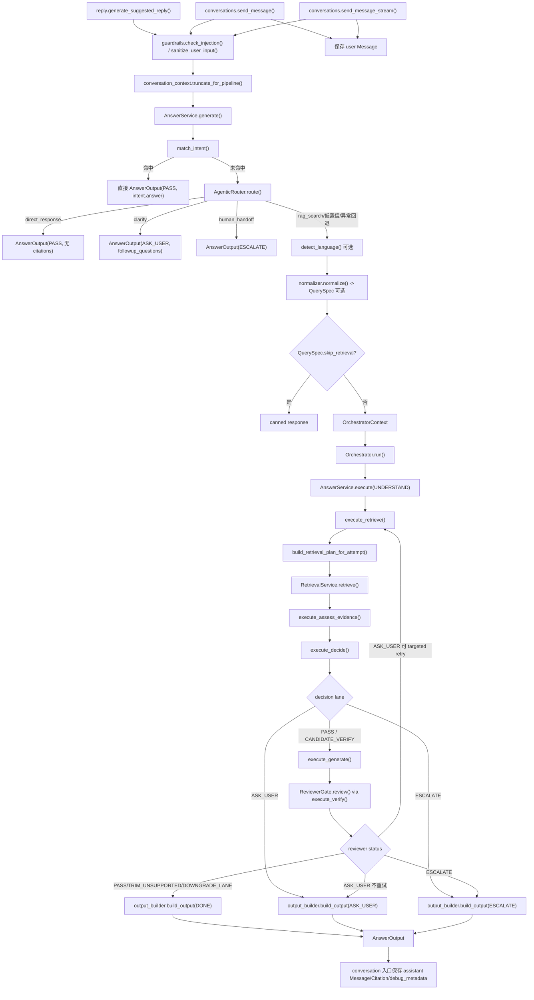
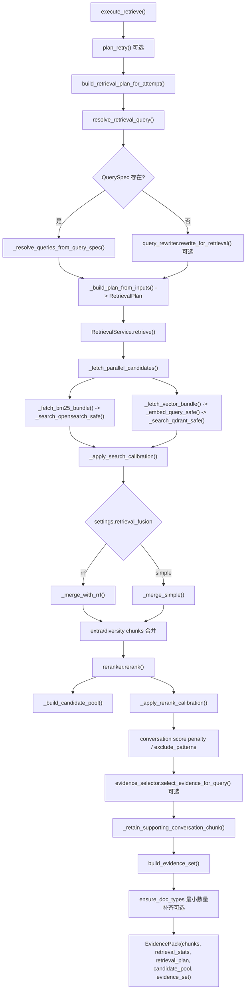
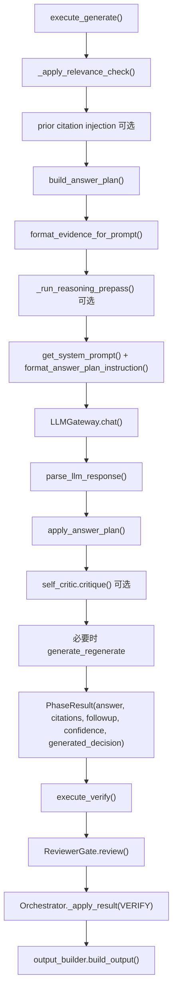

# 02_RAG_FLOW.md

## 结论
RAG 分两条主线：入库线把 source、URL、上传文件、WHMCS 工单转为 Document/Chunk，并写入 PostgreSQL、OpenSearch、Qdrant；查询线从 conversations 或 reply 进入 `AnswerService.generate()`，先检查 intent cache，未命中后由轻量 `AgenticRouter` 判断是否直接回复、追问、转人工或进入 RAG。进入 RAG 时仍经 normalizer、`Orchestrator.run()`、`RetrievalService.retrieve()`、EvidenceSet、LLM、`ReviewerGate.review()` 输出答案和引用。

## 入库流程

## 入库入口

| 入口 | 说明 | 关键文件 |
|---|---|---|
| `POST /v1/admin/ingest` | 将请求中的 documents 交给 Celery 入库任务。 | `app/api/routes/admin.py`, `worker/tasks.py` |
| `POST /v1/admin/ingest-from-source` | 从 `source/` 同步加载 JSON 并逐条入库。 | `app/api/routes/admin.py`, `app/services/source_loaders.py` |
| `POST /v1/documents` | 前端/接口创建单个文档并立即入库。 | `app/api/routes/documents.py` |
| `POST /v1/documents/upload` | 上传 `.txt`、`.md`、`.pdf` 后解析并入库。 | `app/api/routes/documents.py`, `app/services/file_parser.py` |
| `POST /v1/documents/crawl-website` | 抓取网站页面，可选择直接入库；`render_js=true` 时用 Playwright 渲染 JavaScript 后抽取内容，前端默认限制为单页抓取。 | `app/api/routes/documents.py`, `app/services/web_crawler.py`, `app/services/url_fetcher.py` |
| `POST /v1/admin/ingest-tickets-to-file` | 将已批准工单导出到 `source/sample_conversations.json`。 | `app/api/routes/admin.py`, `app/services/ticket_sync.py` |
| `scripts/ingest_from_source.py` | CLI 方式从 source 入库。 | `scripts/ingest_from_source.py` |
| `scripts/ingest_tickets_from_source.py` | CLI 方式从 sample conversations 入库。 | `scripts/ingest_tickets_from_source.py` |

## 入库阶段说明
- 读取：`source_loaders.py` 支持 pages、articles、plans、sales_kb、sample_conversations 等格式；URL/整站抓取默认使用静态 HTML，显式开启 `render_js` 时使用 Playwright 获取渲染后的页面内容。前端 JS 渲染模式默认提交 `max_pages=1`、`max_depth=0`，避免浏览器整站抓取超时。
- 分类：部分入口会调用 `doc_type_classifier.resolve_doc_type`，是否启用受配置影响。
- 清洗/分块：`prepare_document()` 读取 `raw_text` / `raw_html` / `content`，HTML 通过 `_clean_html()` 去除 script/style/nav/footer/header/aside 并保留 heading 和链接；随后 `_chunk_by_semantic_boundaries()` 先按 heading/段落形成 parent chunks，再由 `_expand_to_semantic_units()` 形成 `PreparedChunk`。`chunk_parent_refs_enabled` 开启时会写入 `parent_ref` 和 `parent_heading`。
- 落库：Document、Chunk 写入 PostgreSQL。
- 关键词索引：OpenSearch 写入 chunk，用于 BM25。
- 向量索引：embedding provider 生成向量，Qdrant 写入 chunk 向量。
- 同步源文件：部分 Documents API 会调用 `source_sync` 同步到 source JSON。

## 函数级入库链路

### 入库已确认细节
- `IngestionService.ingest_document()` 的幂等键是 `Document.source_url` + cleaned content checksum。
- 内容未变化且未 `force_reindex` 时，不重新分块、embedding 或索引；只更新标题、文档类型、日期、metadata、source_file 并 `flush()`。
- 更新已有文档时，会先读取旧 chunk id，调用 `OpenSearchClient.delete_chunk()` 和 `QdrantSearchClient.delete_chunk()`，再删除 DB 中旧 Chunk。
- 新建或更新后，会先 `ensure_index()` 和 `ensure_collection(dimensions)`，再逐 chunk 写 DB、embedding、Qdrant、OpenSearch。
- 原文对象存储已确认：如果 raw 存在且 `get_storage()._get_client()` 可用，会写入 `raw/{_checksum(url)}.txt`，content type 为 `text/plain`。
- 事务边界已确认：`db_session.commit()` 在所有 chunk 的 embedding、Qdrant upsert、OpenSearch index 完成之后执行；函数内没有显式跨 PostgreSQL/OpenSearch/Qdrant 的补偿事务。
- 索引失败路径已确认：`OpenSearchClient.index_chunk()` 和 `QdrantSearchClient.upsert_chunk()` 的异常会向上抛出；删除旧索引时 `delete_chunk()` 内部是 best-effort 记录 warning。

## 查询流程

## 查询入口

| 入口 | 适用场景 | 持久化 |
|---|---|---|
| `POST /v1/reply/generate` | 任意工单/客服系统的一次性建议回复。 | 不创建会话，不保存消息。 |
| `POST /v1/conversations/{id}/messages` | 已创建会话中的同步问答。 | 保存 user message、assistant message、citations、debug_metadata。 |
| `POST /v1/conversations/{id}/messages:stream` | SSE 流式返回。 | 生成完成后保存 assistant message 和 citations。 |

流式入口除既有 `status`、`ping`、`content`、`citations`、`done`、`error` 事件外，可额外输出 `trace` 事件，事件数据来自 `debug_metadata.trace.nodes` 的节点摘要。旧客户端可以忽略未知 `trace` 类型，仍按原有答案事件完成渲染。

### 查询 debug_metadata
- `debug_metadata.timings` 会返回 `query_extract`、`retrieve`、`assess_evidence`、`rerank`、`generate`、`verify`、`total` 的秒级耗时；这些字段也会作为 `debug_metadata` 顶层字段返回，缺失阶段以 `0.0` 返回。
- `debug_metadata.retry_count` 返回实际发生的检索重试次数，不改变 RAG 分支逻辑。
- `debug_metadata.agentic_router` 是可选字段：intent cache 命中时只标记 `skipped=true` 和 `reason=intent_cache_hit`；Router 执行时记录 `route`、`tool`、`reason`、`confidence`、`skipped` 和 `fallback_to_rag`。顶层 API 字段不因该字段改变。
- `debug_metadata.trace` 是可选执行快照：记录 intent、Agentic Router 选择、稳定逻辑节点路径、工具摘要和毫秒级耗时，用于前端流程可视化和调试，不改变 RAG 决策、答案生成或顶层 API 字段。

### Agentic Router 接入点

在 guardrails 通过且 intent cache 未命中后，`AnswerService.generate()` 会先执行轻量 Agentic Router。

- `rag_search`：继续现有 `query extract -> retrieve -> assess evidence -> retry -> generate -> verify`。
- `direct_response`：用于问候和能力说明，直接返回 `PASS`，不检索。
- `clarify`：信息不足时返回 `ASK_USER` 和追问。
- `human_handoff`：账号、账单、安全、删除、退款执行等人工处理请求返回 `ESCALATE`。

低置信或 Router 异常必须回退 `rag_search`，不影响现有 RAG 可用性。`app/services/decision_router.py` 仍是检索后的证据决策器，不与本 Router 混用。

## 函数级查询链路

## 函数级检索链路

### QuerySpec 到 RetrievalPlan 的映射已确认
- `build_retrieval_plan_for_attempt()` 是运行时入口。
- `resolve_retrieval_query()` 决定本轮 selected query：优先 retry suggested query，其次 verify targeted retry 的 explicit override，其次 fallback rewrite candidate，最后 base query。
- 有 QuerySpec 时，`_resolve_queries_from_query_spec()` 优先使用 `keyword_queries[0]` 和 `semantic_queries[0]`；无 QuerySpec 且启用 `query_rewriter_use_llm` 时，调用 `rewrite_for_retrieval()` 生成 keyword/semantic/profile。
- `retrieval_profile`、`answer_type`、`doc_type_prior`、active hypothesis、hard requirements、required evidence、evidence families 会共同推导 preferred doc types、authoritative/supporting doc types、page_kind/product_family hints、fetch_n、rerank_k 和 budget_hint。
- pricing/policy/troubleshooting profile 会提高 fetch/rerank 预算；pricing 会额外倾向包含 `tos`。

## 函数级生成与校验链路

### Reviewer 失败后的状态机已确认
- `PASS`：进入 `DONE`。
- `TRIM_UNSUPPORTED`：如有 `trimmed_answer`，替换答案后进入 `DONE`。
- `DOWNGRADE_LANE`：如有 `trimmed_answer`，替换答案并降级 lane 后进入 `DONE`。
- `ESCALATE`：进入 `ESCALATE` 输出。
- `ASK_USER`：如果 `targeted_retry_enabled`、仍可重试、未用过 verify targeted retry、`retry_reason` 属于 `type_mismatch` / `overclaim` / `unsupported_exact` 且有 `suggested_queries`，则设置 `retry_query_override` 并回到 `RETRY_RETRIEVE`；否则进入 `ASK_USER` 输出。
- 任一 phase 抛异常时，`Orchestrator.run()` 捕获后通过 `build_output(ESCALATE)` 结束。

## 关键组件
- `AnswerService`：RAG 总编排入口。
- `match_intent`：意图缓存命中时跳过检索和 LLM。
- `AgenticRouter`：intent cache 未命中后、固定 RAG 流程前的轻量工具选择器；支持 `rag_search`、`direct_response`、`clarify`、`human_handoff`，低置信或异常默认回退 `rag_search`。
- `normalize_query`：生成 QuerySpec，包含 canonical query、required evidence、retrieval profile 等。
- `Orchestrator`：按 UNDERSTAND、RETRIEVE、ASSESS_EVIDENCE、DECIDE、GENERATE、VERIFY 阶段推进。
- `RetrievalService`：执行 BM25 + 向量检索、RRF/simple 融合、rerank、EvidenceSet 构建。
- `LLMGateway`：调用 OpenAI-compatible chat completions。
- `ReviewerGate`：生成后校验和风险拦截。
- `output_builder`：构建最终 AnswerOutput。

## 仍待代码确认
- `app/core/storage.py` 的具体后端实现、MinIO bucket 创建和失败日志策略仍需单独确认。
- `documents.delete_document()` 的删除路径已知是 best-effort 清理 OpenSearch/Qdrant 后删除 DB 和同步 source JSON，但是否需要离线修复 orphan index 的运维脚本仍待确认。
- `scripts/ingest_tickets_from_source.py` 与 `scripts/import_whmcs_sql_dump_to_tickets.py` 的 CLI 参数、事务边界和重复导入策略仍待逐文件确认。
- `ReviewerGate.review()` 内部 claim-level 规则、soft contract 和 final lane 计算细节仍待单独展开。
