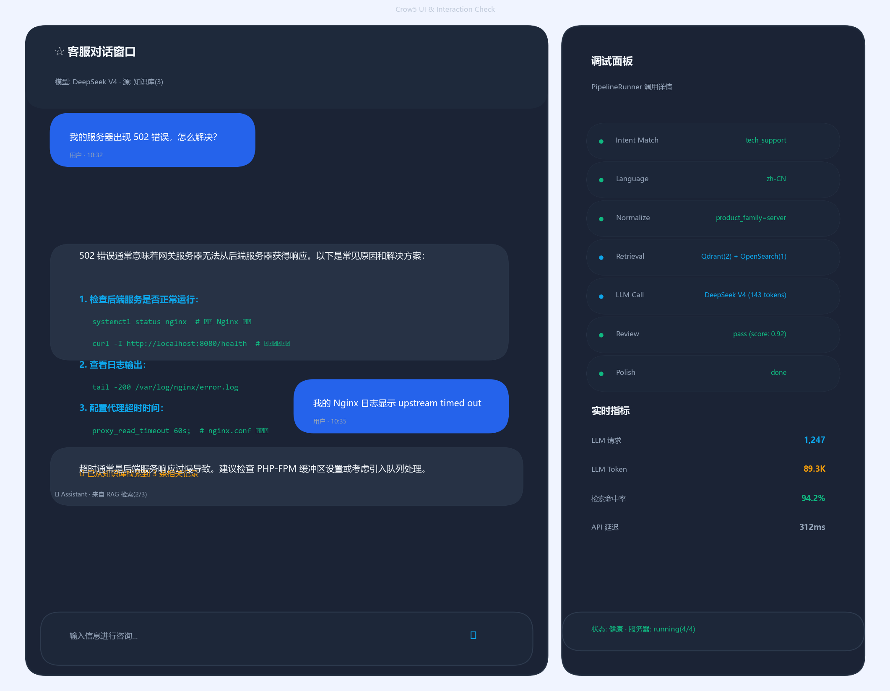
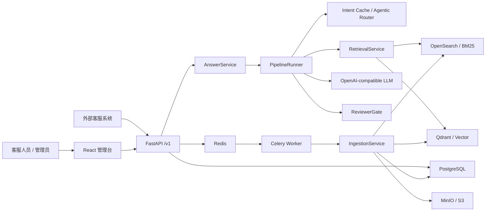
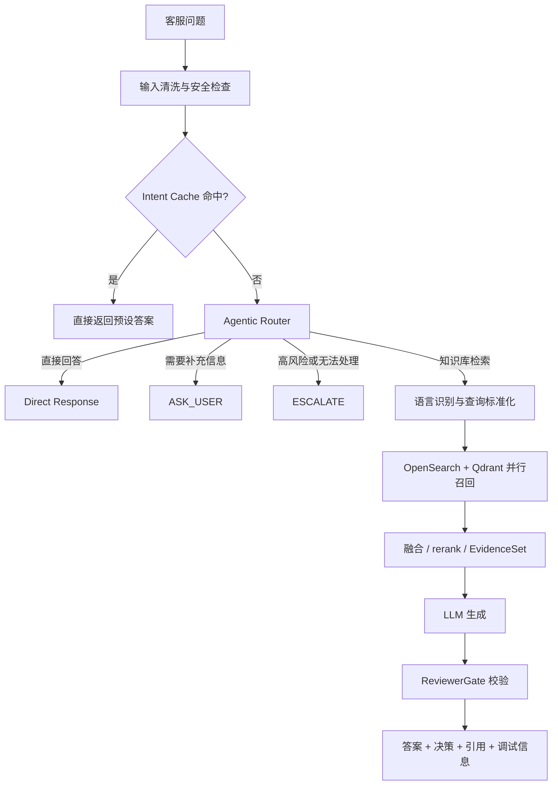
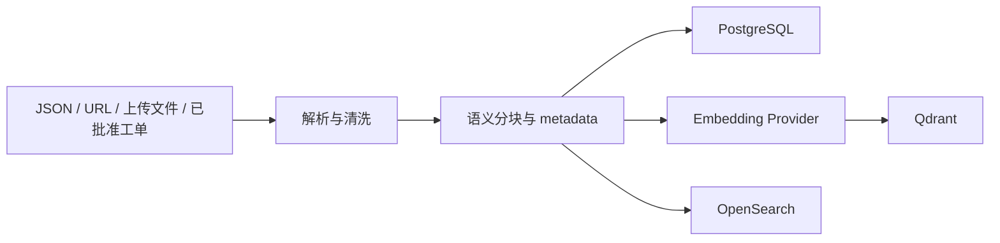

# Support AI Assistant｜企业客服 RAG 系统

[](https://www.python.org/)
[](https://fastapi.tiangolo.com/)
[](https://react.dev/)
[](https://www.typescriptlang.org/)

一个面向企业客服场景的全栈 RAG 项目：将文档、网页、上传文件和优质工单沉淀为可检索知识库，通过意图路由、查询标准化、混合检索、证据评估、LLM 生成和回答审核，输出带引用、可追踪的客服建议回复。

> 项目定位：用于展示企业级 RAG 系统从知识入库、检索生成到质量控制和管理后台的完整工程链路。

[功能概览](#功能概览) · [系统架构](#系统架构) · [核心流程](#核心流程) · [快速开始](#快速开始) · [API 集成](#api-集成) · [测试与评测](#测试与评测)

---

## 项目演示

> **图片占位：客服对话与引用展示**
>
> 建议替换为真实运行截图，内容包括：用户问题、RAG 回答、引用来源、回答决策和调试信息。
> 推荐路径：`docs/images/chat-interface.png`

<!-- 替换图片后删除上方占位文字，并取消下面一行的注释。 -->


<table>
  <tr>
    <td width="50%" align="center">
      <strong>图片占位：知识库管理</strong><br />
      展示文档上传、URL 导入、文档类型和索引状态
    </td>
    <td width="50%" align="center">
      <strong>图片占位：系统监控</strong><br />
      展示服务健康检查、请求统计和基础设施状态
    </td>
  </tr>
</table>

建议后续分别保存为：

- `docs/images/knowledge-base.png`
- `docs/images/dashboard-health.png`

截图请使用演示数据并隐藏 API Key、用户名、内网地址等敏感信息；如果指标不是实测结果，请明确标注“示例数据”。

## 项目解决什么问题

传统客服知识通常分散在产品文档、网页、历史工单和人工经验中，容易出现检索困难、回答口径不一致、结果缺少依据等问题。本项目将这些信息统一进入知识库，并在生成回复前后增加路由、检索和审核环节。

一次请求可以得到三类结果：

- **直接回答**：命中高置信意图缓存时跳过 RAG，降低延迟和模型成本。
- **检索生成**：从 OpenSearch 与 Qdrant 召回证据，生成带引用的客服回复。
- **风险控制**：证据不足时继续追问或转人工，避免无依据回答和过度承诺。

## 功能概览

| 能力 | 实现 |
|---|---|
| 多源知识入库 | 支持 `source/` JSON、单 URL 获取、文件上传和已批准工单样本 |
| 混合检索 | OpenSearch BM25 + Qdrant 向量检索，支持融合、rerank 和证据选择 |
| 查询编排 | `PipelineRunner` 统一执行路由、标准化、检索、评估、生成和校验 |
| 回答质量控制 | EvidenceSet、ReviewerGate、claim-level review 和 targeted retry |
| 客服工作台 | 会话、文档、仪表盘、意图缓存、文档类型、模型配置和健康检查 |
| 外部系统集成 | 提供无状态建议回复 API、会话 API、SSE 流式响应和多种认证方式 |
| 持续学习 | 优质客服工单经审批后可回写知识源并重新入库 |
| 可观测性 | 结构化日志、Prometheus metrics、链路追踪和阶段调试信息 |

## 我的工作与工程实践

> 以下内容用于公开展示项目贡献。发布前请根据你的真实职责删改，避免保留未参与的工作。

- 搭建 FastAPI、React、PostgreSQL、Redis/Celery、OpenSearch、Qdrant 和 MinIO 组成的完整应用架构。
- 设计文档清洗、语义分块、元数据处理、Embedding 和双检索索引入库流程。
- 实现 BM25 与向量检索并行召回、候选融合、rerank、EvidenceSet 和证据质量门控。
- 将查询链路收口到 `PipelineRunner` 状态机，统一依赖、阶段计时、模型路由和终态输出。
- 将大型 `QuerySpec` 拆分为意图、检索提示、澄清需求、回答契约和查询槽位等明确数据契约。
- 引入回答审核与定向重试机制，处理证据不足、引用缺失和高风险承诺等问题。
- 建立离线检索评测和诊断报告，区分路由短路、召回失败、重试耗尽与模型调用失败。
- 完成管理后台、JWT/API Token 认证、健康检查和 OpenAI-compatible 模型配置能力。

## 技术亮点

### 1. 混合检索而非单一路径

BM25 更擅长命中产品名、错误码和专有名词，向量检索更适合语义相近但表达不同的问题。项目并行使用两类检索，再通过融合和 rerank 形成候选证据，减少单一召回方式的盲区。

### 2. 显式状态机编排

`PipelineRunner` 是查询链路唯一编排入口。各阶段通过类型化上下文传递结果，路由、检索、评估、决策、生成和校验边界清晰，便于单元测试、定位失败阶段和扩展策略。

### 3. 证据约束与回答审核

系统不会把“检索到内容”等同于“可以回答”。检索结果先形成 EvidenceSet 并评估覆盖度，生成后再由 ReviewerGate 检查引用与声明；证据不足时返回追问或转人工决策。

### 4. 可替换模型与配置中心

LLM 和 Embedding 使用 OpenAI-compatible 接口，可接入不同供应商或私有服务。数据库 Settings 的优先级高于 `.env` fallback，便于通过管理台调整模型和 RAG 开关。

## 系统架构

> **图片占位：系统架构图**
>
> 建议绘制“访问层 → API 与异步任务 → RAG 管线 → 数据与模型服务”四层架构。
> 推荐路径：`docs/images/architecture-overview.png`



### 运行服务

| 服务 | 职责 | 默认访问地址 |
|---|---|---|
| Frontend | React/Vite 管理台 | `http://localhost:5174` |
| API | FastAPI 业务接口和 Swagger | `http://localhost:8000` |
| Worker | 文档异步入库 | 无公开端口 |
| PostgreSQL | 业务数据、文档、分块、会话和配置 | `127.0.0.1:5433` |
| Redis | 缓存、任务队列和结果后端 | `127.0.0.1:6380` |
| OpenSearch | BM25 关键词检索 | `127.0.0.1:19200` |
| Qdrant | 向量检索 | `127.0.0.1:6333` |
| MinIO | 上传文件和原文对象存储 | `127.0.0.1:9000` |

## 核心流程

### 查询链路



### 知识入库



入库过程使用来源地址和内容 checksum 做幂等判断。内容未变化时可只更新 metadata；内容变化时替换旧分块和检索索引，避免新旧数据混用。

## 技术栈

| 层级 | 技术 |
|---|---|
| 前端 | React 19、TypeScript、Vite、Tailwind CSS |
| 后端 | Python 3.11+、FastAPI、Pydantic v2、SQLAlchemy、Alembic |
| 异步任务 | Redis、Celery |
| 检索 | OpenSearch、Qdrant、RRF、Reranker |
| 模型接入 | OpenAI SDK、OpenAI-compatible Chat Completions / Embeddings |
| 数据与对象存储 | PostgreSQL、MinIO / S3 compatible |
| 可观测性 | Prometheus、结构化日志、OpenTelemetry |
| 部署 | Docker Compose、Nginx（`full` profile） |

## 快速开始

### 环境要求

- Docker 与 Docker Compose
- 可用的 OpenAI-compatible LLM/Embedding 服务
- 本地开发时需要 Python 3.11+ 和 Node.js

### 1. 准备配置

```powershell
copy .env.example .env
```

至少检查以下配置：

```env
OPENAI_API_KEY=sk-your-api-key
ADMIN_API_KEY=replace-with-your-admin-key
JWT_SECRET=replace-with-a-strong-secret
```

如使用其他 OpenAI-compatible 服务，还需配置对应的 `OPENAI_BASE_URL` 和模型名称。不要把真实密钥提交到公开仓库。

### 2. 启动服务

```powershell
docker-compose up -d
docker-compose ps
```

启动后访问：

- 管理台：`http://localhost:5174`
- Swagger：`http://localhost:8000/docs`
- MinIO Console：`http://localhost:9001`

### 3. 初始化数据库和管理员

> 以下命令会修改本地数据库，请确认当前连接的是开发环境。

```powershell
docker-compose exec api alembic upgrade head
docker-compose exec api python -m scripts.create_admin_user
```

### 4. 导入示例知识库

> 入库会写入 PostgreSQL、OpenSearch 和 Qdrant。首次运行前可先使用 dry run 检查数据。

```powershell
docker-compose exec api python scripts/ingest_from_source.py --dry-run
docker-compose exec api python scripts/ingest_from_source.py
```

## API 集成

业务 API 默认使用 `/v1` 前缀，支持 Bearer JWT、`X-API-Key`、`X-Admin-API-Key` 和数据库 API Token。

外部客服系统可调用无状态建议回复接口：

```powershell
curl -X POST http://localhost:8000/v1/reply/generate `
  -H "Content-Type: application/json" `
  -H "Authorization: Bearer YOUR_JWT" `
  -d '{
    "query": "用户询问退款政策，并希望取消订单。",
    "source_type": "ticket",
    "source_id": "TKT-12345"
  }'
```

返回结果包含回答、决策、引用、置信度和可能的追问。`decision` 可能是：

- `PASS`：证据和回答满足要求。
- `ASK_USER`：缺少必要信息，需要追问。
- `ESCALATE`：风险较高或证据不足，建议转人工。

更多接口可在运行后访问 `http://localhost:8000/docs`，或通过管理台的“API 参考”页面查看。

## 测试与评测

### 基础验证

```powershell
pytest tests/ -v
```

```powershell
cd frontend
npm run build
```

### RAG 评测

项目提供离线评测脚本，可统计：

- Recall@5、Hit@5 和 MRR
- 路由短路、完整召回、部分召回和零召回数量
- 请求 P50/P95/P99 与重试分组延迟
- 模型调用、限流、业务无效案例和重试耗尽原因
- 失败案例、召回缺口和慢查询诊断包

> **实测结果占位**
>
> 运行固定数据集后，将结果填入下表。不要填写未经验证或不同环境下不可复现的数据。

| 指标 | 实测结果 | 测试条件 |
|---|---:|---|
| Recall@5 | 待补充 | 固定评测集、冷启动 |
| MRR | 待补充 | 固定评测集、冷启动 |
| 总延迟 P50 | 待补充 | 本地 Docker 环境 |
| 总延迟 P95 | 待补充 | 本地 Docker 环境 |

详细命令与报告字段见 [开发命令](.agent-harness/03_DEV_COMMANDS.md)。

## 项目结构

```text
app/
├── main.py                 # FastAPI 入口
├── api/routes/             # 认证、会话、回复、文档、工单、管理和健康检查
├── core/                   # 配置、认证、日志、指标和链路追踪
├── db/                     # SQLAlchemy 模型和数据库会话
├── services/               # 查询编排、检索、入库、模型网关和业务服务
├── services/phases/        # retrieve、assess、decide、generate、verify 阶段
└── search/                 # OpenSearch、Qdrant、Embedding 和 Reranker
frontend/                   # React 管理台
worker/                     # Celery 应用与异步任务
scripts/                    # 初始化、知识入库、评测和调试脚本
source/                     # 示例知识源
alembic/                    # 数据库迁移
.agent-harness/             # 项目地图、RAG 流程和开发约束
```

## 当前边界与后续计划

这是用于学习和工程实践的完整项目，不代表已经过真实生产流量验证。公开展示时建议明确以下边界：

- 实际回答质量依赖知识库内容、模型能力和 reranker 配置。
- 首次启动需要多个基础设施容器，资源占用高于单体 Demo。
- 评测指标受模型、网络、数据集和本地硬件影响，应同时说明测试条件。
- 生产部署还需要补充密钥管理、备份恢复、容量规划和更严格的权限策略。

后续可继续完善：

- 补充真实操作 GIF 和在线演示环境。
- 建立稳定的公开评测集和版本化性能基线。
- 增加端到端集成测试和多租户数据隔离。
- 将详细部署、配置和 API 文档继续拆分到 `docs/`。

## 安全说明

- 不要提交 `.env`、API Key、JWT Secret、客户数据或真实工单。
- 示例截图应使用脱敏数据，不展示内网地址和账户信息。
- 数据库迁移、向量索引重建和知识入库会修改运行数据，请仅在确认目标环境后执行。
- 公开部署时应设置强 `JWT_SECRET`、限制 CORS，并按需关闭 Swagger/Redoc。

## License

> **许可证占位**：公开仓库前请添加 `LICENSE` 文件，并在此处声明采用的许可证。
>
> 如果暂未选择许可证，默认并不代表他人可以自由复制、修改或分发本项目。

---

如果这个项目用于求职展示，建议优先补齐三项内容：真实产品截图、可复现的评测结果、与你实际经历一致的“我的工作”。
