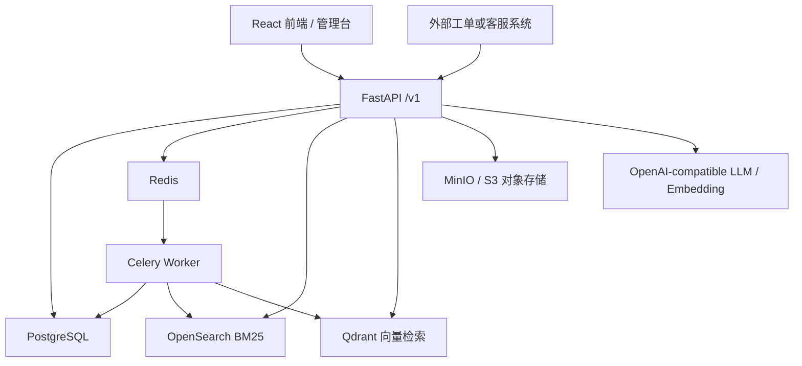
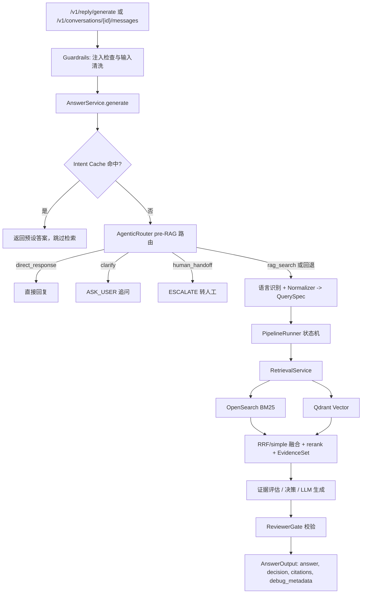
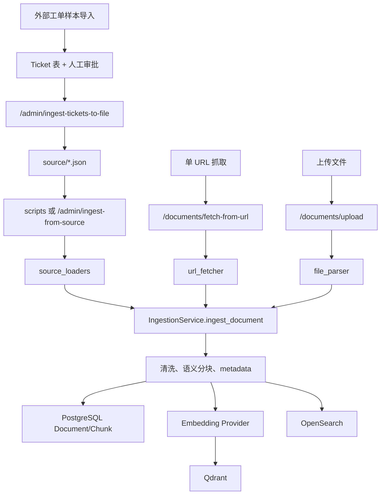

# 企业客服知识库 RAG 智能问答系统

[](https://python.org)
[](https://fastapi.tiangolo.com)
[](https://react.dev)

## 结论

这是一个面向企业客服、工单和 livechat 场景的 RAG 支持助手。项目由 FastAPI 后端、React 管理台、PostgreSQL、Redis/Celery、OpenSearch、Qdrant 和 MinIO 组成，核心能力是把文档、网页、上传文件和工单样本沉淀为知识库，再通过统一的 `PipelineRunner` 状态机执行意图路由、查询标准化、混合检索、证据评估、LLM 生成和审核，输出可引用、可追踪的客服建议回复。

适合的使用方式：

- 作为内部客服控制台：管理知识库、会话、工单、意图缓存、文档类型、模型配置和 API Token。
- 作为外部系统的建议回复 API：Zendesk、livechat 或自建 helpdesk 可直接调用 `/v1/reply/generate`。
- 作为持续学习闭环：上传或导入工单样本，经审核后回写到 `source/sample_conversations.json` 并重新入库。

## 目录

- [系统架构](#系统架构)
- [重构后的架构边界](#重构后的架构边界)
- [核心流程](#核心流程)
- [功能模块](#功能模块)
- [技术栈](#技术栈)
- [快速开始](#快速开始)
- [数据入库与持续学习](#数据入库与持续学习)
- [API 与集成](#api-与集成)
- [认证方式](#认证方式)
- [配置说明](#配置说明)
- [常用命令](#常用命令)
- [项目结构](#项目结构)
- [测试与验证](#测试与验证)
- [检索评测与性能基线](#检索评测与性能基线)
- [故障排查](#故障排查)

## 系统架构



运行时服务：

| 服务 | 职责 | 默认访问 |
|---|---|---|
| `frontend` | React/Vite 构建后的管理台，由容器内 nginx 提供静态页面。 | `http://localhost:5174` |
| `api` | FastAPI 后端，挂载认证、会话、回复、文档、工单、后台配置和健康检查接口。 | `http://localhost:8000` |
| `worker` | Celery worker，处理异步文档入库任务。 | 无公开端口 |
| `postgres` | 业务数据库，保存文档、分块、会话、消息、工单、配置、用户和 token。 | `127.0.0.1:5433` |
| `redis` | 缓存、队列 broker 和 Celery result backend。 | `127.0.0.1:6380` |
| `opensearch` | BM25/关键词检索索引。 | `127.0.0.1:19200` |
| `qdrant` | 向量检索集合。 | `127.0.0.1:6333` |
| `minio` | S3 兼容对象存储，保存上传或原文对象。 | `127.0.0.1:9000`，控制台 `9001` |

`docker-compose --profile full up -d` 会额外启用 `nginx` 网关并监听 `80` 端口。

## 重构后的架构边界

当前工作区已完成查询链路的阶段性重构，核心边界如下：

| 边界 | 当前职责 |
|---|---|
| `AnswerService` | 保持 API 调用兼容的薄门面，只负责把请求交给 `PipelineRunner.run()`。 |
| `PipelineRunner` | 唯一编排与依赖所有者；统一执行 intent cache、Agentic Router、标准化、检索、评估、决策、生成和校验。`Orchestrator` 仅保留为兼容别名。 |
| `OrchestratorContext` | 保存状态机上下文、类型化阶段结果、重试状态、审核结果、计时和调试信息，不再依赖运行时动态字段。 |
| `QuerySpec` | 由 `QueryIntent`、`RetrievalHints`、`ClarificationNeeds`、`AnswerContract`、`QuerySlots` 五个子数据类组成。 |
| Phase 输出 | `RetrievePhaseOutput`、`GeneratePhaseOutput`、`VerifyPhaseOutput` 和 `OrchestratorDebug` 明确阶段间数据契约。 |
| `RetrievalService` | 负责并行 BM25/向量召回、校准、融合、rerank、候选池和 EvidenceSet；预算与文档类型策略由数据类承载。 |
| `normalization.py` | answer mode、support level、answer type、product family、page kind、doc type 等标准化逻辑的单一来源。 |

模型选择、阶段计时和终态输出均由 `PipelineRunner` 统一协调。RAG 阶段实现仍位于 `app/services/phases/`，便于独立测试和维护。

## 核心流程

### 查询流程



关键点：

- `AgenticRouter` 在 intent cache 未命中后执行，支持 `rag_search`、`direct_response`、`clarify`、`human_handoff`。低置信或异常会回退到 RAG。
- 检索使用 OpenSearch + Qdrant，支持 RRF 融合、rerank、doc type 多样性、EvidenceSet 和质量门控。
- 生成后会经过 reviewer / claim-level review / targeted retry 等校验逻辑，降低无证据回答和高风险过度承诺。
- 会话接口会保存消息、引用和 `debug_metadata`；无状态建议回复接口不会创建会话。

### 入库流程



关键点：

- `IngestionService` 以 `Document.source_url` 和内容 checksum 做幂等判断。
- 内容未变化且未 `force_reindex` 时，只更新 metadata，不重新分块、embedding 或索引。
- 文档更新时会删除旧 chunk 的 OpenSearch/Qdrant 索引和 DB 记录，再写入新索引。
- URL 抓取支持静态 HTML；显式开启 `render_js` 时使用 Playwright 渲染。当前已移除整站 crawler 服务和对应前端页面，仅保留单 URL 获取及已有 URL 文档的重新抓取。

## 功能模块

| 模块 | 当前能力 |
|---|---|
| 会话管理 | 创建会话、同步/流式发送消息、保存引用和 debug metadata，可关联 ticket/livechat。 |
| 建议回复 | `POST /v1/reply/generate` 提供无状态客服建议回复，适合集成外部系统。 |
| 文档管理 | 文档 CRUD、单 URL 抓取、单篇/全部 URL 文档重新抓取、上传文件、同步 source JSON。 |
| 工单学习 | 工单样本导入、审批 pending/approved/rejected、导出已批准样本回写至知识库。 |
| RAG 管线 | PipelineRunner 状态机、Agentic Router、组合式 QuerySpec、混合检索、EvidenceSet、证据质量门控、ReviewerGate、targeted retry。 |
| 配置中心 | LLM、Embedding、Reranker、架构开关、system prompt、branding、意图缓存、文档类型。 |
| 健康检查 | 快速检查 PostgreSQL/Redis；综合检查 LLM、Embedding、Reranker、PostgreSQL、Redis、Qdrant 和 OpenSearch。 |
| 认证和集成 | JWT 登录、DB API Token (`sk_*`)、环境变量 API key、管理员 key。 |
| 管理台 | 会话、文档、仪表盘、意图缓存、文档类型、设置、健康检查、API Token、API Reference。 |

前端当前导航入口包括：会话管理、文档管理、仪表盘、意图缓存、文档类型、设置、健康检查、API Token、API 参考。tickets 详情路由仍保留，但 crawler 页面和路由已移除。

## 技术栈

| 层级 | 技术 |
|---|---|
| 后端 API | Python 3.11+、FastAPI、Pydantic v2、Uvicorn |
| 数据库 | PostgreSQL、SQLAlchemy、Alembic |
| 异步任务 | Redis、Celery |
| 检索 | OpenSearch、Qdrant、RRF、reranker |
| LLM/Embedding | OpenAI SDK，兼容 OpenAI Chat Completions / Embeddings 的模型服务 |
| 爬虫和解析 | Playwright、BeautifulSoup、lxml |
| 观测 | Prometheus metrics、结构化日志、OpenTelemetry tracing |
| 前端 | React 19、Vite 7、TypeScript、Tailwind CSS、lucide-react |
| 对象存储 | MinIO / S3 compatible |

## 快速开始

### 1. 准备环境变量

```powershell
copy .env.example .env
```

至少需要设置：

```env
OPENAI_API_KEY=sk-your-api-key
ADMIN_API_KEY=your-admin-key
JWT_SECRET=replace-with-a-strong-secret
```

如果使用 DeepSeek、Qwen、GLM、Kimi、SiliconFlow 或私有中转服务，保持 OpenAI-compatible 接口即可，同时设置 `OPENAI_BASE_URL` 和模型名。运行时更推荐在前端 Settings 中修改 LLM / Embedding 配置，因为数据库配置优先级高于 `.env` fallback。

### 2. 启动服务

```powershell
docker-compose up -d
```

访问入口：

- API: `http://localhost:8000`
- Swagger: `http://localhost:8000/docs`
- 前端: `http://localhost:5174`
- MinIO Console: `http://localhost:9001`

### 3. 初始化数据库和管理员

```powershell
docker-compose exec api alembic upgrade head
docker-compose exec api python -m scripts.create_admin_user
```

本地服务已连接好数据库时，也可以使用：

```powershell
make init-db
make create-admin
```

### 4. 导入初始知识库

```powershell
docker-compose exec api python scripts/ingest_from_source.py
docker-compose exec api python scripts/ingest_tickets_from_source.py
```

或本地执行：

```powershell
make ingest
python scripts/ingest_tickets_from_source.py
```

### 5. 本地开发模式

如果只想本地启动 API 和前端，可先用 Docker Compose 启动基础设施，再运行：

```powershell
uvicorn app.main:app --reload
celery -A worker.celery_app worker --loglevel=info
```

```powershell
cd frontend
npm run dev
```

Vite 本地开发默认访问 `http://localhost:5173`；Docker 前端访问 `http://localhost:5174`。

## 数据入库与持续学习

### source 文件

`source/` 是主要知识源目录，常见文件包括：

| 文件 | 用途 |
|---|---|
| `sample_docs.json` | 静态文档、网页、政策、FAQ、价格页等。 |
| `sample_conversations.json` | 高质量工单或客服会话样本。 |
| `custom_docs.json` | 管理后台创建并同步回文件的文档。 |

`app/services/source_loaders.py` 支持 `pages`、`articles`、`plans`、`sales_kb`、`sample_conversations` 等格式。

### URL 和上传

- 单 URL 抓取：`POST /v1/documents/fetch-from-url`
- 上传文件：`POST /v1/documents/upload`
- 重新抓取：`POST /v1/documents/{id}/re-crawl` 或 `POST /v1/documents/re-crawl-all`

### 工单样本闭环

1. 通过 `POST /v1/admin/ingest-tickets-to-file` 或手动编辑将工单样本放入 `source/sample_conversations.json`。
2. 人工审批高质量工单为 `approved`（pending 和 rejected 样本不参与知识库检索）。
3. 运行 `python scripts/ingest_tickets_from_source.py` 将已批准样本 embedding 并写入 OpenSearch/Qdrant。

## API 与集成

所有业务 API 默认带 `/v1` 前缀。

### 常用端点

| 模块 | 方法和路径 | 说明 |
|---|---|---|
| Auth | `POST /v1/auth/login` | 用户名密码登录，返回 JWT。 |
| Auth | `GET /v1/auth/me` | 获取当前用户。 |
| Auth | `GET/POST/DELETE /v1/auth/tokens` | 管理 DB API Token。 |
| Conversations | `GET/POST /v1/conversations` | 会话列表和创建。 |
| Conversations | `POST /v1/conversations/{id}/messages` | 同步聊天。 |
| Conversations | `POST /v1/conversations/{id}/messages:stream` | SSE 流式聊天。 |
| Reply | `POST /v1/reply/generate` | 无状态建议回复，适合外部客服系统。 |
| Documents | `GET/POST/PATCH/DELETE /v1/documents` | 文档管理。 |
| Documents | `POST /v1/documents/fetch-from-url` | 从 URL 抓取文档。 |
| Documents | `POST /v1/documents/upload` | 上传文件并入库。 |
| Tickets | `GET /v1/tickets` | 工单列表。 |
| Tickets | `GET /v1/tickets/{id}` | 工单详情。 |
| Admin | `POST /v1/admin/ingest` | 异步入库文档。 |
| Admin | `POST /v1/admin/ingest-from-source` | 从 `source/` 同步入库。 |
| Admin | `PATCH /v1/admin/tickets/{id}/approval` | 更新工单审批状态。 |
| Admin | `GET/PUT /v1/admin/config/llm` | LLM 配置。 |
| Admin | `GET/PUT /v1/admin/config/embedding` | Embedding 配置。 |
| Admin | `GET /v1/admin/vector-index/status` | 查询向量索引重建状态和进度。 |
| Admin | `POST /v1/admin/vector-index/rebuild` | 异步重建 Qdrant 向量索引。 |
| Admin | `GET/PUT /v1/admin/config/reranker` | Reranker 配置。 |
| Admin | `GET/PUT /v1/admin/config/archi` | RAG 架构开关。 |
| Admin | `GET/POST/PUT/DELETE /v1/admin/intents` | 意图缓存管理。 |
| Admin | `GET/POST/PUT/DELETE /v1/admin/doc-types` | 文档类型管理。 |
| Health | `GET /v1/health` | 健康检查。 |
| Health | `POST /v1/health/check` | 综合检查模型与核心基础设施连通性。 |
| Metrics | `GET /v1/metrics` | Prometheus 指标。 |
| Dashboard | `GET /v1/dashboard/stats` | 仪表盘统计。 |

### 建议回复示例

```powershell
curl -X POST http://localhost:8000/v1/reply/generate `
  -H "Content-Type: application/json" `
  -H "Authorization: Bearer YOUR_JWT" `
  -d '{
    "query": "用户询问退款政策，并希望取消订单。",
    "source_type": "ticket",
    "source_id": "TKT-12345"
  }'
```

响应会包含：

```json
{
  "answer": "...",
  "decision": "PASS",
  "followup_questions": [],
  "citations": [],
  "confidence": 0.9
}
```

`decision` 可能为 `PASS`、`ASK_USER` 或 `ESCALATE`。

### 会话聊天示例

```powershell
curl -X POST http://localhost:8000/v1/conversations `
  -H "Content-Type: application/json" `
  -H "Authorization: Bearer YOUR_JWT" `
  -d '{"source_type": "ticket", "source_id": "TKT-12345", "metadata": {}}'
```

```powershell
curl -X POST http://localhost:8000/v1/conversations/{CONVERSATION_ID}/messages `
  -H "Content-Type: application/json" `
  -H "Authorization: Bearer YOUR_JWT" `
  -d '{"content": "请根据我们的政策回复这个退款问题。"}'
```

## 认证方式

API 支持三类认证：

| 方式 | Header | 适用场景 |
|---|---|---|
| Bearer JWT | `Authorization: Bearer <token>` | 前端登录、普通业务 API、管理员 JWT。 |
| API Key | `X-API-Key: <key>` | 外部系统集成；可来自环境变量 `API_KEY` 或 DB token。 |
| Admin API Key | `X-Admin-API-Key: <key>` | 管理和入库接口；来自环境变量 `ADMIN_API_KEY`。 |

生产环境必须设置强 `JWT_SECRET`，并限制 `CORS_ORIGINS`。`DOCS_ENABLED=false` 可隐藏 `/docs` 和 `/redoc`，但 `/openapi.json` 会保留给前端 API Reference 使用。

## 配置说明

### LLM、Embedding 和 Reranker

运行时优先读取数据库中的 Settings 配置；数据库为空时回退到 `.env`。当前数据库配置覆盖 LLM、Embedding、Reranker 和架构开关。

关键变量：

| 变量 | 说明 |
|---|---|
| `OPENAI_API_KEY` | LLM/embedding 默认 API key。 |
| `OPENAI_BASE_URL` | OpenAI-compatible base URL。 |
| `LLM_MODEL` | 主生成模型。 |
| `LLM_FALLBACK_MODEL` | 主模型失败时的备用模型。 |
| `LLM_MODEL_ECONOMY` | normalizer、evidence、polish 等轻量任务模型。 |
| `EMBEDDING_PROVIDER` | `openai`、`custom` 或 `ollama`。 |
| `EMBEDDING_MODEL` | embedding 模型名。 |
| `EMBEDDING_DIMENSIONS` | 向量维度，必须与 Qdrant collection 一致。 |

常见 OpenAI-compatible provider：

| 供应商 | Base URL 示例 |
|---|---|
| DeepSeek | `https://api.deepseek.com` |
| 阿里云百炼 / Qwen | `https://dashscope.aliyuncs.com/compatible-mode/v1` |
| 智谱 GLM | `https://open.bigmodel.cn/api/paas/v4` |
| 月之暗面 / Kimi | `https://api.moonshot.cn/v1` |
| 硅基流动 | `https://api.siliconflow.cn/v1` |

### 检索和 RAG 开关

常用配置入口：

| 变量或配置 | 说明 |
|---|---|
| `RETRIEVAL_TOP_N` | 每个检索源召回候选数。 |
| `RETRIEVAL_FUSION` | `rrf` 或 `simple` 融合策略。 |
| `RETRIEVAL_RRF_K` | RRF 排名常数。 |
| `MAX_RETRIEVAL_ATTEMPTS` | 最大检索尝试次数。 |
| `EVIDENCE_SELECTOR_USE_LLM` | 是否用 LLM 做 coverage-aware evidence selection。 |
| `EVIDENCE_QUALITY_USE_LLM` | 是否用 LLM 做证据质量门控。 |
| `GENERATE_REASONING_ENABLED` | 生成最终答案前是否做内部 reasoning prepass。 |
| `SELF_CRITIC_ENABLED` | 是否启用 self-critic。 |
| `FINAL_POLISH_ENABLED` | 是否启用最终润色。 |
| `PIPELINE_LOGGING_ENABLED` | 是否记录 RAG 各阶段日志。 |

### 基础设施

| 变量 | 说明 |
|---|---|
| `DATABASE_URL` / `DATABASE_URL_SYNC` | PostgreSQL 异步和同步连接。 |
| `REDIS_URL` / `CELERY_BROKER_URL` | Redis 缓存、Celery broker/backend。 |
| `OPENSEARCH_HOST` | OpenSearch 地址。 |
| `QDRANT_HOST` / `QDRANT_PORT` | Qdrant 地址。 |
| `OBJECT_STORAGE_URL` | MinIO/S3 endpoint。 |
| `OBJECT_STORAGE_BUCKET` | 默认 `support-ai-docs`。 |

## 常用命令

### Docker

```powershell
docker-compose up -d
docker-compose ps
docker-compose logs api
docker-compose logs worker
docker-compose --profile full up -d
```

### 数据库和管理员

```powershell
docker-compose exec api alembic upgrade head
docker-compose exec api python -m scripts.create_admin_user
make init-db
make create-admin
```

### 入库

```powershell
make ingest
make ingest-dry
python scripts/ingest_from_source.py
python scripts/ingest_from_source.py --dry-run
python scripts/ingest_tickets_from_source.py
```

### 后端和前端开发

```powershell
uvicorn app.main:app --reload
celery -A worker.celery_app worker --loglevel=info
pytest tests/ -v
```

```powershell
cd frontend
npm run dev
npm run build
npm run preview
```

## 项目结构

```text
app/
  main.py                 FastAPI 应用入口，注册 /v1 路由和中间件
  api/routes/             auth、conversations、reply、documents、tickets、admin、dashboard、health
  core/                   config、auth、gateway、logging、metrics、rate limit、tracing
  db/                     SQLAlchemy models、session
  services/               PipelineRunner 编排、入库、检索、LLM、配置、工单同步、URL 抓取
  services/phases/        retrieve、assess、decide、generate、verify 等 RAG 阶段
  search/                 OpenSearch、Qdrant、embedding、reranker
  crawlers/               工单样本爬虫脚本
worker/
  celery_app.py           Celery app
  tasks.py                异步入库任务
frontend/
  src/App.tsx             前端路由和主导航
  src/pages/              会话、文档、仪表盘、设置、健康检查、Token、API 参考等页面
alembic/                  数据库迁移
scripts/                  初始化、入库、工单导入和调试脚本
source/                   运行时知识源文件目录
nginx/                    full profile 网关配置
.agent-harness/           Codex 项目地图、服务地图、RAG 流程和变更约束文档
```

## 测试与验证

后端：

```powershell
pip install -e ".[dev]"
pytest tests/ -v
```

前端：

```powershell
cd frontend
npm run build
```

文档-only 修改通常不需要启动服务；检查 Markdown 文件存在、标题结构和关键路径即可。

## 检索评测与性能基线

项目使用 `.scratch/resume-eval/run_resume_eval.py` 评估真实 RAG 查询链路。报告版本 2.0，包含：

- **Benchmark 有效性**：区分业务有效/无效 case，无效原因分类（generation_failure、generic_error_answer、missing_termination 等）
- **分层指标**：all_cases、retrieval_executed、route_short_circuited、invalid_cases 各有独立 denominator
- **路由汇总**：RAG search、clarification、human_handoff、direct_response 计数
- **召回分组**：full_recall、partial_recall、zero_recall 计数
- **延迟分组**：no_retry、retried、max_retry 分组 P50/P95/P99
- **LLM 轻量统计**：默认采集 task/model/attempt/duration/status（含 429 rate-limited），不含 prompt/response
- **Retry 收敛诊断**：含 exhaustion_reason（达到上限时非空）
- **自动诊断包**：`*-diagnosis.json` 自动生成，包含失败、慢查询、重试和召回缺口

### 退出码语义

- `0`：Benchmark 有效（所有 case 业务有效）
- `2`：Benchmark 无效（存在业务无效 case），报告仍会写出以便诊断

### 运行 100 条冷启动评测

以下命令适用于 Windows PowerShell。完整控制台日志单独落盘，终端最后只读取结构化汇总：

```powershell
cd D:\ai_project\RAG_Search

# 清理 LLM 缓存，确保本轮为真实冷启动
docker-compose exec -T api python -c "import asyncio; from app.services.llm_gateway import clear_llm_cache; print(asyncio.run(clear_llm_cache()))"

# 100 条评测；--case-delay 防止连续调用压垮模型网关
docker-compose exec -T api python .scratch/resume-eval/run_resume_eval.py `
  --dataset-json artifacts/offline_eval/datasets/eval_cases_v1.json `
  --limit 100 `
  --source-url-prefix eval://retrieval/ `
  --case-timeout 180 `
  --case-delay 0.5 `
  --output-json /tmp/benchmark-cold-100.json `
  --output-md /tmp/benchmark-cold-100.md `
  *> artifacts/offline_eval/benchmark-cold-100-console.log

docker-compose cp api:/tmp/benchmark-cold-100.json artifacts/offline_eval/benchmark-cold-100.json
docker-compose cp api:/tmp/benchmark-cold-100.md artifacts/offline_eval/benchmark-cold-100.md
# 诊断包自动生成
docker-compose cp api:/tmp/benchmark-cold-100-diagnosis.json artifacts/offline_eval/benchmark-cold-100-diagnosis.json
```

评测结束后输出核心指标：

```powershell
$data = Get-Content artifacts/offline_eval/benchmark-cold-100.json -Raw | ConvertFrom-Json
$bv = $data.summary.benchmark_validity

[PSCustomObject]@{
  BenchmarkValid = $bv.valid
  InvalidCount   = $bv.invalid_count
  InvalidReasons = ($bv.invalidation_reasons | ConvertTo-Json -Compress)
  Cases          = $data.summary.dataset_cases
  ValidCases     = $data.summary.successful_cases
  RecallAt5      = $data.summary.retrieval_quality.recall_at_5
  HitAt5         = $data.summary.retrieval_quality.hit_at_5
  MRR            = $data.summary.retrieval_quality.mrr
  TotalP50       = $data.summary.latency_seconds.p50
  TotalP95       = $data.summary.latency_seconds.p95
  NoRetryP95     = $data.summary.latency_groups.no_retry.p95
  RetriedP95     = $data.summary.latency_groups.retried.p95
} | Format-List
```

### CLI 参数

| 参数 | 默认值 | 说明 |
|---|---|---|
| `--limit` | 36 | 最大评测条数 |
| `--case-timeout` | 180 | 单条超时秒数 |
| `--case-delay` | 0.5 | case 间隔秒数，防止 429 |
| `--dataset-json` | 无 | 外部评测集 JSON 路径 |
| `--source-url-prefix` | 无 | 限定检索 source 前缀 |
| `--capture-llm-calls` | false | 启用完整 LLM prompt/response 追踪 |
| `--output-json` | 必填 | JSON 输出路径 |
| `--output-md` | 必填 | Markdown 输出路径 |

### 诊断包

评测完成后自动在 JSON 报告旁生成 `*-diagnosis.json`，包含：

- `summary`：核心指标摘要
- `invalid_cases`：无效 case 列表及失败类别
- `route_short_circuited`：路由短路 case
- `recall_failures`：零/部分召回 case（含预期与实际 source）
- `slowest_cases`：最慢 10 条及分阶段耗时
- `retried_cases`：重试 case 及收敛原因

诊断包不含 prompt、response 或完整证据文本，可直接交给 AI 分析。

## 故障排查

| 问题 | 排查建议 |
|---|---|
| `docker-compose up` 启动失败 | 检查 `.env` 是否设置 `JWT_SECRET`；查看 `docker-compose logs api`。 |
| 前端无法登录 | 确认已运行迁移和 `create_admin_user`，并检查 JWT 配置。 |
| API 返回 401 | 检查 Bearer JWT、`X-API-Key` 或 `X-Admin-API-Key` 是否正确。 |
| 入库后检索不到内容 | 先运行 `make ingest-dry` 检查 source 格式，再看 api/worker 日志和 OpenSearch/Qdrant 状态。 |
| 切换 embedding 模型后知识库问答暂停 | 在 Settings 的“向量化模型”中确认配置和维度，然后执行“重建向量索引”；完成前系统会阻止检索，避免混用新旧向量空间。 |
| 向量索引重建失败 | 在 Settings 查看脱敏错误，修正模型、Base URL、API key 或维度后重新执行；失败状态下不会自动恢复知识库问答。 |

| 综合健康检查失败 | 在管理台健康检查页或 `POST /v1/health/check` 查看具体服务、延迟和脱敏错误；模型检查会产生少量真实请求。 |
| LLM 无响应或模型错误 | 检查 Settings 中 LLM 配置、`.env` fallback、`OPENAI_BASE_URL` 和 provider 模型名。 |
| 答案被追问或转人工 | 查看 `debug_metadata`、pipeline 日志、EvidenceSet 和 reviewer 结果，确认知识库证据是否足够。 |

## 维护约定

- README 是当前主要入口文档；历史 README 或 README_zh 说明以本文件为准。
- 修改 RAG 查询链路时，同步检查 `.agent-harness/02_RAG_FLOW.md`。
- 修改服务拓扑、端口或依赖服务时，同步检查 `.agent-harness/01_SERVICE_MAP.md`。
- 修改脚本、测试或运行命令时，同步检查 `.agent-harness/03_DEV_COMMANDS.md`。
- 不要在未确认环境的情况下运行清库、删除 volume、生产抓取或大规模重建索引命令。
